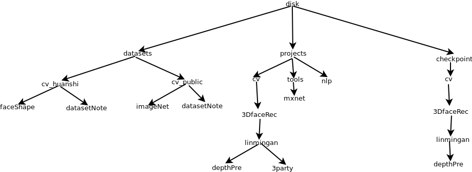

##实验室机器使用规范

该规范主要是数据和项目的组织规范，请务必按照该规范组织项目。在有新数据或者新项目时请按照下面的组织方式进行组织，下面进行说明：

</img>

我们会将所有的东西都放在挂载的硬盘上，上图的根disk（不一定非要这个名字）即为挂载的硬盘。在根目录下会有3个文件夹，分别为datasets、projects、checkpoint。这三个文件夹的子目录会按照图像处理(cv)、自然语言处理（nlp）、音频/语音处理(speech)以及动画（animation）进行详细划分。接下来分别说一下每个文件夹的组织，主要以图像处理为例，其他方向的可以此类推。

除了上面的三个文件夹，还有有一个backup文件夹，没有画出来。这个文件夹是用来存放已经离职的同事留下来的项目。

###datasets

atasets下面会有cv、nlp等方向的子文件夹，每个方向分别会有两个文件夹，分别存放网上下载的数据集和公司内部的数据集。以cv来说，会有cv_public(网上下载的数据集)和cv_huanshi（公司内部的数据集）。

在cv_public可能会有imageNet、COCO等数据集，上图中只画出了imageNet。在cv_huanshi中可能会有faceShape、race等数据集，上图中我只画出了faceShape。

另外，不管是cv_public还是cv_huanshi里面都会有datasetNote文件夹。datasetNote主要是存放一些文本文件，这些文本文件的名字和与datasetNote文件夹同级的数据集文件夹同名，里面的内容为同名数据集的一些说明。**也就是说每增加一份数集就必须在datasetNote里面增加相应的说明文档。**

###projects

projects目录主要是用来存放项目代码的。同样的project里面也会有cv、nlp、speech、animation文件夹。另外多了一个tools文件夹，这个文件夹用来诸如mxnet、caffe这样的通用工具的；请不要冒然安装新的工具，如有需要，先咨询其他同事是否已经有安装。

还是以cv为例，进行详细说明。对于一个新成立的项目（比如3D人脸重建），项目成员有2个人。首先需要判断该项目是属于cv，还是nlp。假设该项目属于cv，那么首先需要在cv下面创建一个名字为3DfaceRec的文件夹。 接着每个成员创建自己的目录，比如linmingan（林明安），wusongcheng（吴松城），尽量用全拼。然后创建一个项目，如linmingan下面创建了depthPre。**该项目创建初始就应该提交到gitlab上去。其他成员通过拉取gitlab相应的项目，重新开一个分支进行开发。**

可以看到，在linmingan目录下还有一个3party目录，这个是用于存放别人的开源代码的，并且这个开源项目是不需要在自己的项目中使用的。每个项目成员，有用到，或者想要测试一下别人的开源项目，就应该将开源项目放在自己的3party目录里面。如果开源项目作为自己项目的一部分，就需要将开源项目合并到自己的项目中，而不是存放在3party里面。并且合并的时候，应该保留开源项目的git信息。

###checkpoint

chekpoint目录主要是用来存放，算法训练过程中保存的中间模型参数。另外开辟checkpoint文件夹的目的是，防止在提交项目到gitlab时将这些模型参数也提交上去，这会使得git项目非常大。checkpoint的组织跟project一样，比如项目成员linmingan在训练depthPre时，要保存训练过程中的模型参数。那么就应该将保存目录指定到，checkpoint/cv/3DfaceRec/linmingan/depthPre/目录下面去，具体要保存到那个子文件夹，可随意设定。

具体的例子可以参考192.168.11.170上面的目录组织。
